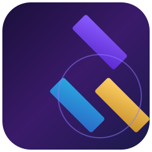

<div align="center">



# 🟪 EAOIN

### *A Triple-A Voxel Sandbox Experience*

**Everything · And · On · Infinite**

[](https://github.com/Loganwall111/EAOIN-LAUNCHER/releases)
[](https://github.com/Loganwall111/EAOIN-LAUNCHER/releases)
[](LICENSE)
[](https://loganwall111.github.io/EAOIN-LAUNCHER/)

</div>

---

**EAOIN** is a next-generation voxel sandbox built with **Babylon.js + React + TypeScript** — a full triple-A-style world generator, physics engine, redstone system, 25+ dimensions, bosses, civilizations, multiplayer, modding, a built-in operating system, a launcher, coloured lighting, and much more — all running in your browser.

> 🎬 **The Final Release** — *Coloured Lighting & World's Edge*

---

## ✨ Features

### 🌍 The World
- Procedural **Perlin-noise mountains**, realistic cliffs & valleys
- **25+ dimensions** — Nether, The End, The Rift, The Humorous, World's Edge and more — each with unique gravity, mobs, ores, music and hazards
- **Rare block-built cities**, villages, suburban streets & movie theatres
- **300+ blocks** across 18 categories, including rails & minecarts, furniture, and decorative blocks

### 🧟 Mobs & Bosses
- **30+ bosses** with multi-phase fights
- Minecraft-inspired mobs: **The Warden**, Allay, Sniffer, Armadillo, Breeze, Sulphur Cube, Rift Jellyfish, Cosmic Jelly and more
- 14 **NPC civilizations** with tech ages from Stone to Multiversal

### ⚙️ Systems
- **Redstone** — levers, buttons, torches, logic circuits
- **2x2 & 3x3 crafting**, tools, weapons, armor, food, plants, decorations
- **Multiplayer** — servers, guilds, nations, voice chat, cross-server
- **Modding** — 17 official mod packs, an in-game **Mod Editor**, and a **launcher** to switch between Public / Experimental / Developer builds

### 🎨 Next-Gen Graphics
- **Volumetric clouds**, SSAO, SSR, Bloom, HDR, god rays, glass refraction
- **Coloured lighting & light mixing** — light changes colour as it passes through other lights
- **Super Settings** — a deep config layer with cameras, ray tracing (experimental), debug tools & more
- **TV & Computer blocks** that project a live view of the game back into the game

### 🎮 Play Everywhere
- Keyboard & mouse (default), plus **controller** and **touch/mobile** support
- A **HorizonOS** in-game operating system: File Explorer, Browser, Game Hub, Music, Mail & Calendar
- A cinematic **AAA intro**, warp-tunnel loading, and an animated **Cosmic Girl**

---

## 🚀 Getting Started

The game is hosted on **GitHub Pages** — no install needed.

**[▶ Play EAOIN Now](https://loganwall111.github.io/EAOIN-LAUNCHER/)**

---

## 🚀 Alpha Preview (EAOIN 2.0)

Want to try the **next-gen 2.0 alpha**? It's built into this same site — no download, no separate install.

### How to launch the alpha

**Option 1 — from the game (recommended)**
1. Open the **stable game** at https://loganwall111.github.io/EAOIN-LAUNCHER/
2. On the main menu, scroll to the bottom and click the **🚀 Alpha Launcher** button.
3. It drops you straight onto the **alpha title screen** — play from there.

**Option 2 — direct link**
Just open the alpha directly in your browser:
👉 **https://loganwall111.github.io/EAOIN-LAUNCHER/alpha/?launch=1**

### What's in the alpha
The 2.0 alpha previews the next-gen update — the Nether & End overhaul, black-hole End sky, severe weather (tornadoes, blizzards, sandstorms, meteor showers), custom buildable portals, the live Game Hub, deeper Nether mobs, sprinting, and the in-game Alpha Launcher.

> ⚠️ **Alpha status:** This is an experimental preview. Expect bugs and unfinished features. The stable **v1.0.0** release remains the fully supported game at the main URL.

---

### Run Locally

```bash
cd EAOIN
npm install
npm run dev       # start the Vite dev server on :3000
npm run build     # production build
npm run test      # run the full test suite
```

---

## 🕹️ Controls

| Action | Input |
|--------|-------|
| Move | `WASD` |
| Look | Mouse |
| Jump / Swim | `Space` |
| Fly | `F` |
| Place / Use | Right-click |
| Mine / Attack | Left-click |
| Chat | `T` |
| Command console | `/` |
| Inventory | `E` / `I` |
| Third-person | `F5` |
| Dimensions menu | `F8` |
| Pause / Menu | `Esc` |

Controller and touch/mobile controls can be enabled in **Settings → Gameplay**.

---

## 📜 Patch Notes

The latest build ships with **coloured lighting**, **World's Edge**, **rails & minecarts**, **stalactites/stalagmites**, glowing coloured water, cameras, TV/Computer screens, furniture, and the full **Super Settings** layer.

Recent additions (both stable and the 2.0 alpha preview):
- **💾 Save & Quit** — the pause menu now has a green **Save & Quit to Menu** button (plus periodic auto-save) that returns you to the main menu instead of the launcher.
- **⛏️ Mineshafts in caves** — abandoned Minecraft-style mineshafts (with a rare deep **Black Mineshaft** variant) spawn inside the cave systems of every dimension.

Full changelog is shown in the in-game launcher.

---

## 🧱 Tech Stack

- **Babylon.js** — WebGL/WebGPU rendering
- **React 18 + TypeScript** — UI
- **Vite** — build tooling
- **Vitest** — testing

---

## 📄 License

Released under the **MIT License**.

<div align="center">

Made with 💜 by **ONEBLOCKAWAY STUDIOS**

</div>
